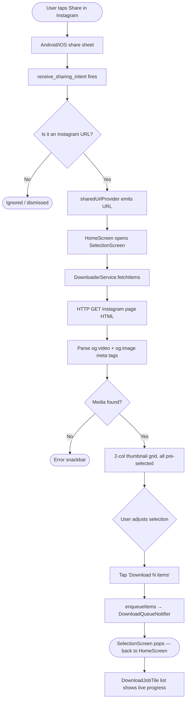
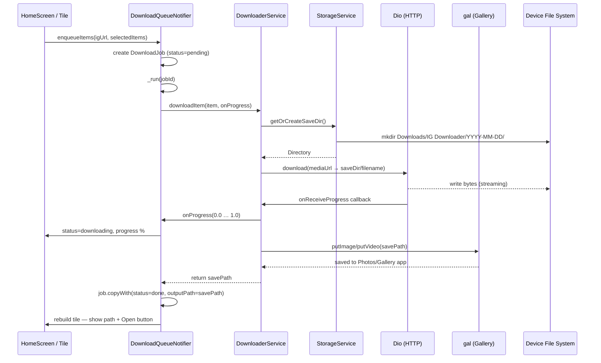
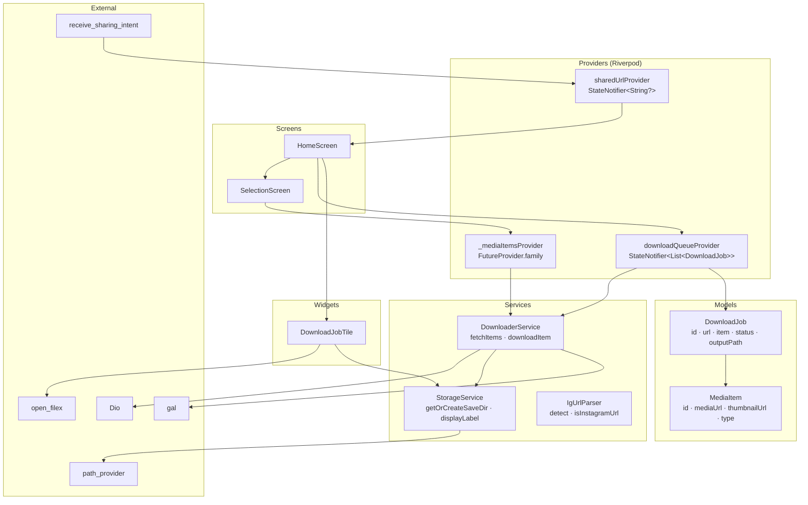
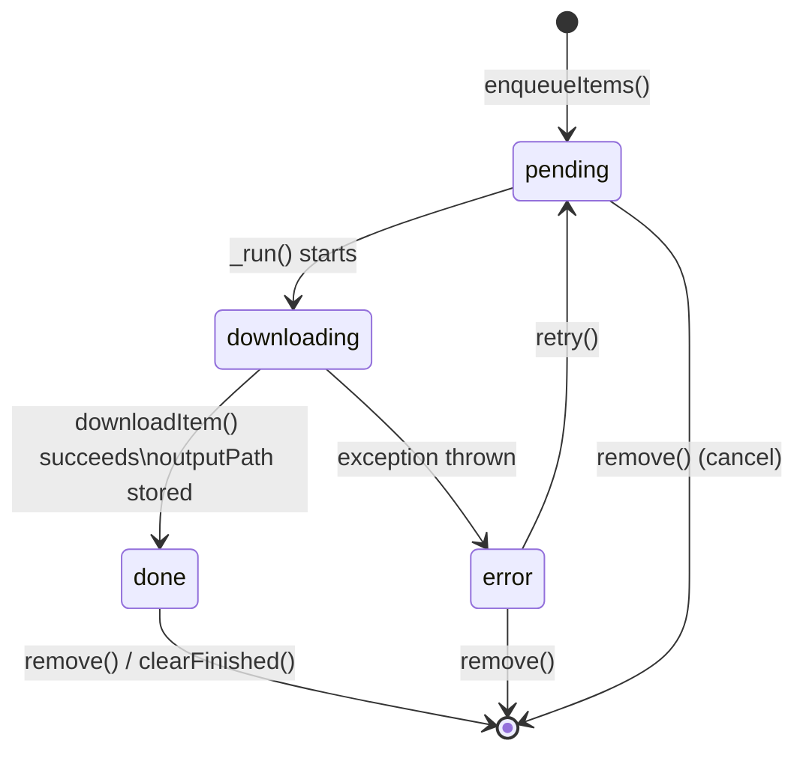

# ig-image-downloader — Architecture & Flow

> Flutter mobile app (Android / iOS) that receives Instagram URLs via the system
> share sheet, lets the user preview and pick media items, then downloads them
> permanently to a dated folder and to the device gallery.

---

## 1. User Flow



---

## 2. Download Pipeline



---

## 3. Architecture Layers



---

## 4. State Machine — DownloadJob



---

## 5. Directory Structure

```
ig-image-downloader/
├── lib/
│   ├── main.dart                   # entry point, ProviderScope
│   ├── app.dart                    # MaterialApp, theme (M3, Instagram pink)
│   ├── models/
│   │   ├── media_item.dart         # MediaItem, MediaItemType
│   │   └── download_job.dart       # DownloadJob, JobStatus, IgMediaType
│   ├── services/
│   │   ├── ig_url_parser.dart      # URL type detection (regex)
│   │   ├── downloader_service.dart # HTML scrape + download via Dio
│   │   └── storage_service.dart   # persistent save-dir resolution
│   ├── providers/
│   │   ├── share_intent_provider.dart
│   │   └── download_queue_provider.dart
│   ├── screens/
│   │   ├── home_screen.dart        # queue list + URL input
│   │   └── selection_screen.dart  # thumbnail grid + pick UI
│   └── widgets/
│       └── download_job_tile.dart  # per-job card with open-file button
├── android/
│   └── app/src/main/AndroidManifest.xml   # ACTION_SEND intent-filter
├── ios/
│   └── Runner/Info.plist           # photo library perms, ATS
├── docs/
│   └── architecture.md            # ← this file
└── .github/
    └── copilot-instructions.md    # agent instructions
```

---

## 6. Key Design Decisions

| Decision | Choice | Reason |
|---|---|---|
| Media extraction | HTML og: meta scraping | No API key needed; works for public posts |
| Download engine | Dio (direct HTTP) | Mobile-first; yt-dlp not available on Android/iOS |
| Gallery save | gal | Cross-platform (Android MediaStore + iOS Photos) |
| Persistent folder | `Downloads/IG Downloader/YYYY-MM-DD/` | User-visible; survives app uninstall on Android |
| State management | Riverpod StateNotifier | No global singletons; explicit provider graph |
| URL handling | receive_sharing_intent | Listens to Android ACTION_SEND / iOS share extension |
